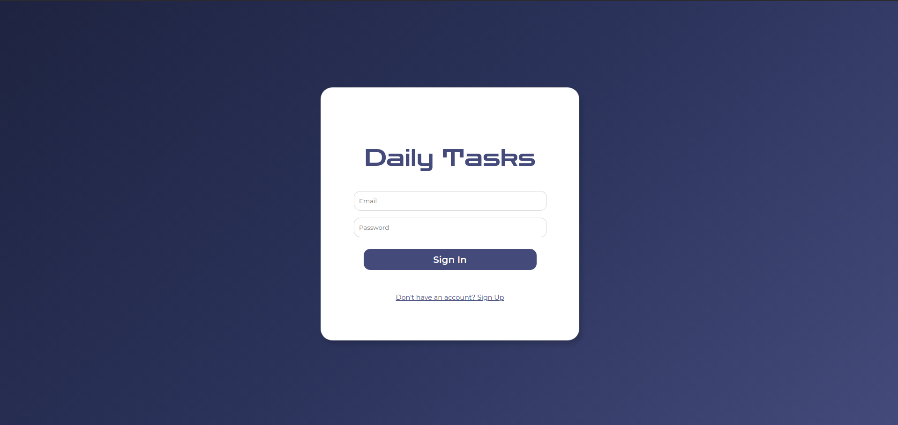
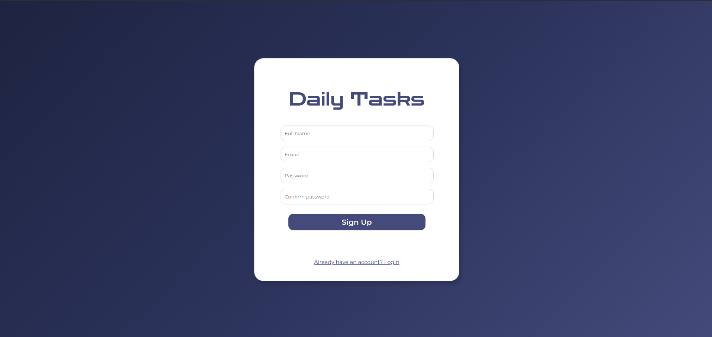
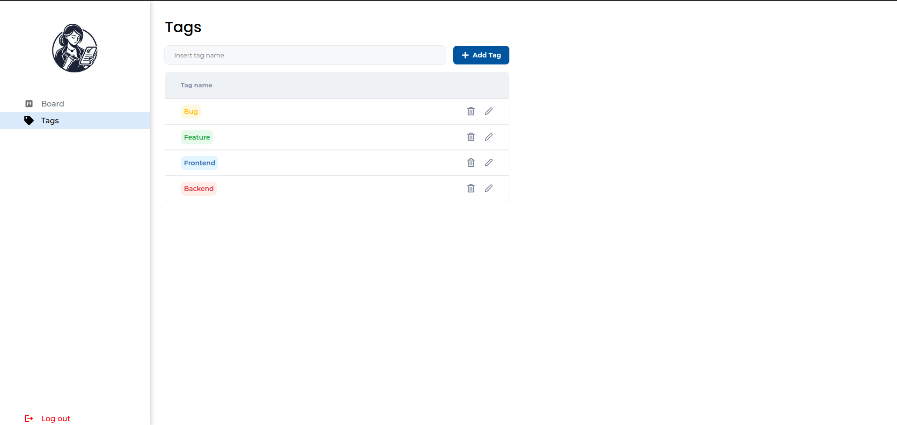
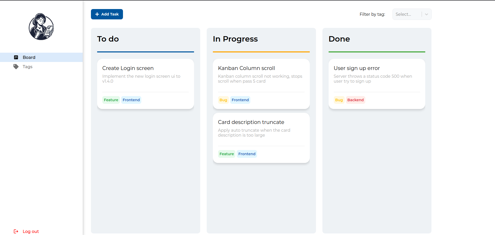
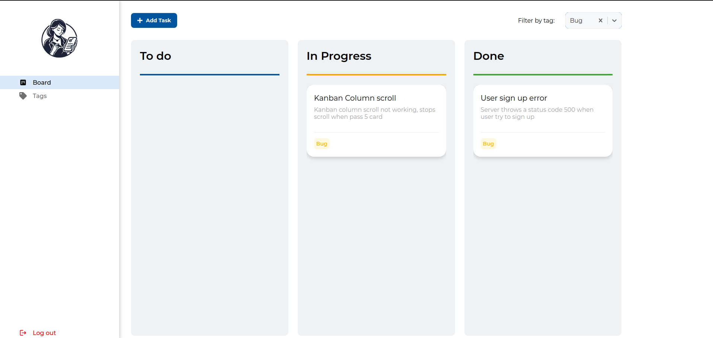

# ✨ Daily Tasks ✨

    
## Overview
**Daily Tasks** is a Kanban board interface designed to help you create, control, and visualize your tasks efficiently. This project is part of my portfolio, showcasing key functionalities and a clean, user-friendly interface for task management.

## 🚀 Features
- **🔐 User Authentication**: Create your own user account to segregate tasks. Since this is a portfolio project, email validation is not required; user accounts are for identification purposes only.
- **📋 Kanban Board**: 
  - Create and describe tasks.
  - Add one or more tags for easy identification of task subjects.
  - Use drag-and-drop functionality to move tasks between columns (To-Do, In Progress, Done).
- **🏷️ Tags**:
  - Create as many tags as needed to organize your tasks.
  - Filter tasks by tag directly on the Kanban board.

## 🛠️ Installation
The project contains separate installation guides for the frontend and backend components. Detailed instructions will be provided in their respective folders:
- [Frontend Installation Guide](./frontend/README.md)
- [Backend Installation Guide](./backend/README.md)

## 🖼️ Project images:






## 📜 License

```
MIT License

Copyright (c) 2025 Vitor Figueiredo

Permission is hereby granted, free of charge, to any person obtaining a copy
of this software and associated documentation files (the "Software"), to deal
in the Software without restriction, including without limitation the rights
to use, copy, modify, merge, publish, distribute, sublicense, and/or sell
copies of the Software, and to permit persons to whom the Software is
furnished to do so, subject to the following conditions:

The above copyright notice and this permission notice shall be included in all
copies or substantial portions of the Software.

THE SOFTWARE IS PROVIDED "AS IS", WITHOUT WARRANTY OF ANY KIND, EXPRESS OR
IMPLIED, INCLUDING BUT NOT LIMITED TO THE WARRANTIES OF MERCHANTABILITY,
FITNESS FOR A PARTICULAR PURPOSE AND NONINFRINGEMENT. IN NO EVENT SHALL THE
AUTHORS OR COPYRIGHT HOLDERS BE LIABLE FOR ANY CLAIM, DAMAGES OR OTHER
LIABILITY, WHETHER IN AN ACTION OF CONTRACT, TORT OR OTHERWISE, ARISING FROM,
OUT OF OR IN CONNECTION WITH THE SOFTWARE OR THE USE OR OTHER DEALINGS IN THE
SOFTWARE.
```

## 📞 Contact
For questions or inquiries, check my Linkedin profile: [Click here](https://www.linkedin.com/in/vitor-figueiredo-b38b99191/).

