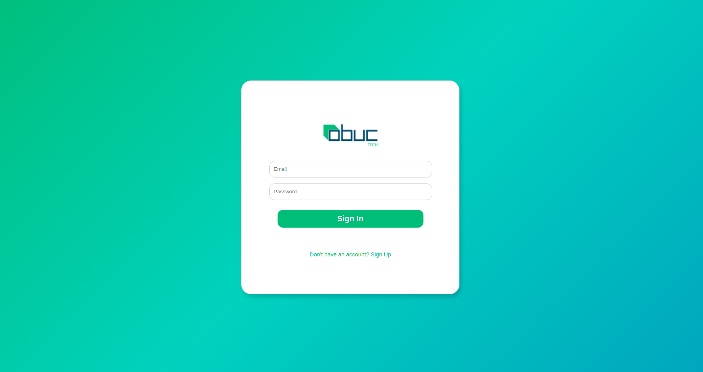
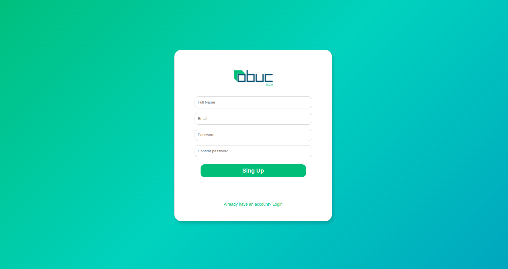
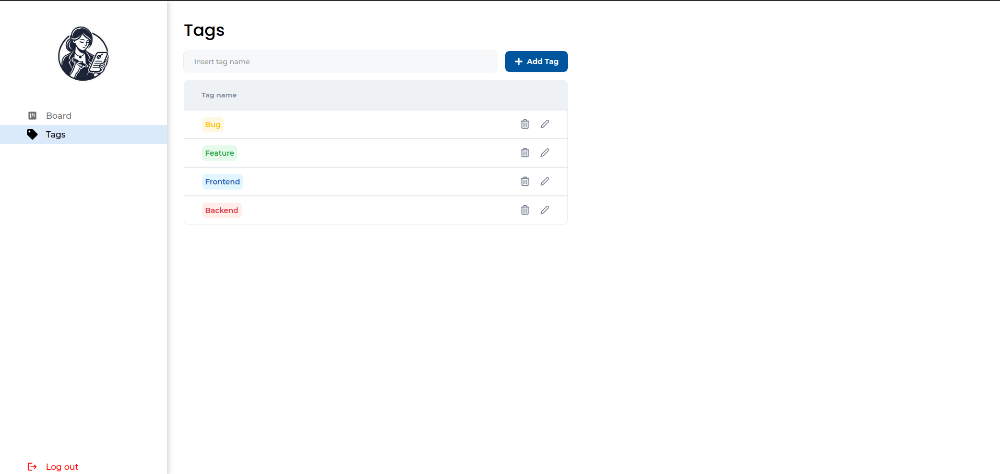
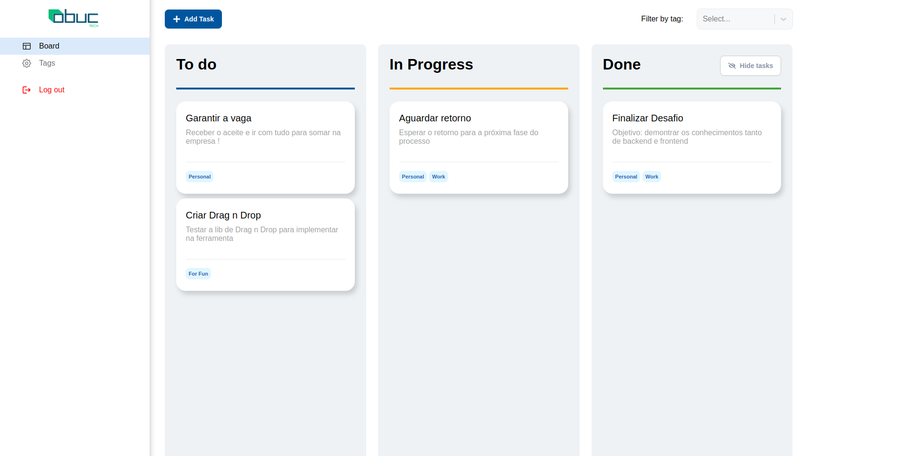
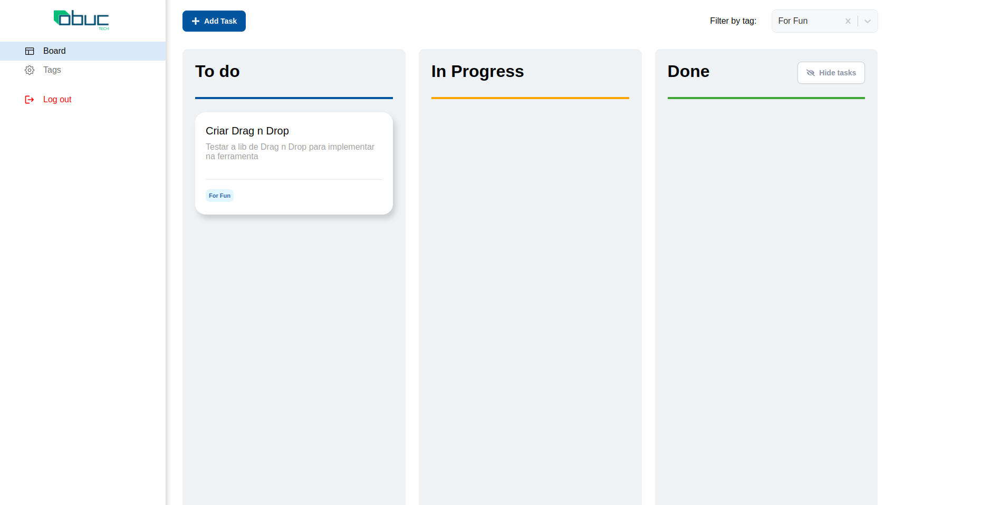

# Documentação de Implementação das funcionalidades propostas

## Introdução
Este projeto é uma aplicação de gestão de tarefas, com funcionalidades principais que incluem visualização em formato Kanban, categorização de tarefas, e visualizações direcionadas. Foram realizadas melhorias essenciais para aprimorar a experiência do usuário, bem como aprimorar a estrutura de backend com autenticação segura e manipulação de dados sensível.

## Melhorias Essenciais

### 1. Sistema de Login e Autenticação
Para uma experiência de usuário personalizada e segregada, foi implementado um sistema de login:

- **Tela de Login**: Interface desenvolvida com personalização própria, destacando-se visualmente para demonstrar a minha capacidade de criação de UI personalizada.
- **Endpoints de Backend**:
  - `POST /user`: Utilizado para criação de usuários.
  - `POST /auth`: Endpoint para autenticação de usuários.
- **Autenticação JWT**: O usuário é autenticado via token JWT, assegurando que cada sessão seja segura.
- **Criptografia de Senhas**: As senhas são criptografadas com `bcrypt` antes de serem salvas no banco de dados.
- **Visualização direcionada**: Cada usuário pode ver apenas suas tarefas e categorias, bem como editar e excluir
- **Logout**: O usuário pode efetuar logout clicando no botão "Log out" na navbar.

### 2. Visualização Kanban
A visualização Kanban foi implementada para oferecer uma visão clara e organizada das tarefas:

- **Colunas de Status**: A tela principal apresenta três colunas, cada uma representando um status, conforme solicitado pelo layout.
- **Condicionamento de Tarefas por Status**: As tarefas são exibidas com base em seu status. Tarefas concluídas há mais de cinco segundos (esse valor pode ser alterado no .env com o valor VITE_DONETIME) são ocultadas, mas podem ser visualizadas ao clicar em "Show hidden tasks".
- **Visualização de Tarefa no Modal**: Ao clicar em uma tarefa, ela é exibida em um modal. O modal permite:
  - Visualizar detalhes.
  - Editar o status.
  - Clicar em "Edit task" para edição completa dos atributos.
- **Exclusão de Tarefas**: O botão "Delete task" permite excluir a tarefa selecionada.

### 3. Categorias e Tags
Foi adicionada uma funcionalidade de categorização de tarefas para melhor organização:

- **Criação de Categorias**: Na aba "Tags", o usuário pode criar novas categorias.
- **Gerenciamento de Tags**: Na mesma aba, o usuário pode editar o nome das tags e deletá-las usando os botões "Lápis" (editar) e "Lixo" (deletar).
- **Atribuição de Tags**: Durante a criação ou edição de uma tarefa, é possível adicionar múltiplas tags. A tarefa também pode ser criada sem tags, caso desejado.
- **Filtragem por Tags**: Acima do Kanban, o usuário pode filtrar as tarefas por tags, facilitando a visualização por categorias específicas.

### 4. Layout
A implementação do layout seguiu as diretrizes do design original, com algumas customizações:

- **Uso de Componentes Existentes**: Todo o layout foi desenvolvido utilizando componentes prontos da aplicação, exceto:
  - Componentes do Kanban, que foram desenvolvidos de forma personalizada.
  - Tela de Login, que foi criada para mostrar um diferencial e a habilidade de personalização.
  
Essas escolhas reforçam a coesão visual e a usabilidade da aplicação.

## Imagens:

---

## Considerações Adicionais

- **Criação de Usuário**:
  - Todos os campos obrigatórios devem ser preenchidos para criação do usuário.
  - Não é necessário um email válido; apenas um valor formatado como email é exigido.
  - Não foram aplicadas regras de segurança adicionais na criação de senhas para facilitar os testes.
  - O email deve ser único, caso contrário não é possível criar um novo usuário

- **Testes**: A implementação de testes para o backend ficou como um possível ponto de melhoria futura, pois não foi realizada para este desafio.

--- 

Esse documento cobre as principais implementações e ajustes feitos. Se precisar de ajustes adicionais ou de mais detalhes em alguma seção, estou à disposição!